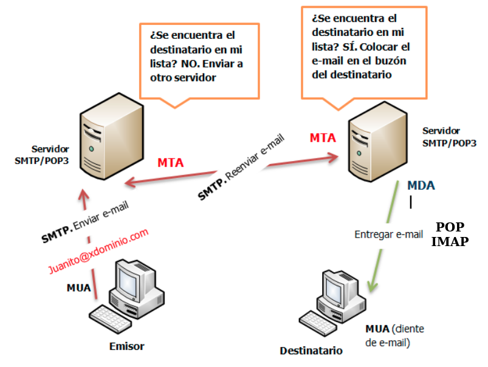

# ¿Cómo mandamos y recuperamos un correo electrónico?

1. Un usuario utiliza un **MUA** para enviar el correo electrónico a su servidor de correos (**MTA**). Este envío se hace usando el protocolo SMTP. El nombre del servidor tendrá que estar definido en un servidor DNS, y en un principio usamos el puerto 25/TCP. Está conexión no está ni autentificada (no hay que indicar usuario/contraseña), ni cifrada. Ya veremos en la actualidad vamos a usar el protocolo ESMTP, que utiliza otro puerto (587/TCP) y permite la autentificación y el cifrado de la comunicación.
2. El **MTA** recibe el correo desde el **MUA**:
    * Si la dirección del destinatario del correo es la misma que la que controla este servidor: el correo no se envía a ningún **MTA** y se le da al MDA para que lo guarde en el buzón del usuario destinatario.
    * Si la dirección del destinatario es distinta que la que controla este servidor, el correo se mandará al **MTA** correspondiente a la dirección del destinatario, esto se puede hacer de dos formas:
        * Si, por cualquier razón el **MTA** no puede enviar el correo directamente al **MTA** destino, puede tener configurado un servidor **MTA** intermediario (**relay**). Le mandará este correo al **MTA** intermediario que será el responsable de enviarlo al destinatario final.
        * Si el **MTA** no tiene configurado un servidor relay, tendrá que averiguar la dirección IP del servidor correspondiente al nombre de correo del destinatario, normalmente haciendo una consulta MX al sistema DNS. Si reciba varios servidores de correo le intentará mandar el correo al más prioritario (el que tiene el número más pequeño).
3. Cuando el correo llega al **MTA** destino, se pasa el correo al **MDA** que lo guardará en el buzón del usuario destinatario.
4. El usuario destinatario usará una **MUA** para conectarse al servidor **MDA** y recuperar el correo:
    * Puede usar el protocolo **POP3**, por lo que se conectará al servidor POP3. Está conexión está autentificada (tendrá que indicar usuario/contraseña) y puede estar cifrada. El protocolo POP3 suele usar el puerto 110/TCP. Con este protocolo lo que hacemos es descargar todos los correos desde nuestro buzón remoto a nuestro **MUA**.
    * Puede usar el protocolo **IMAP**, por lo que se conectará al servidor IMAP. Está conexión está autentificada (tendrá que indicar usuario/contraseña) y puede estar cifrada. El protocolo IMAP suele usar el puerto 143/TCP. Con este protocolo lo que hacemos es sincronizar el estado de los correos desde nuestro buzón remoto a nuestro **MUA**. De tal manera que podemos acceder desde distintos **MUA** y obtenemos el mismo estado de los correos en todos ellos. Es imprescindible si vamos a usar un **MUA** que sea una aplicación web.

